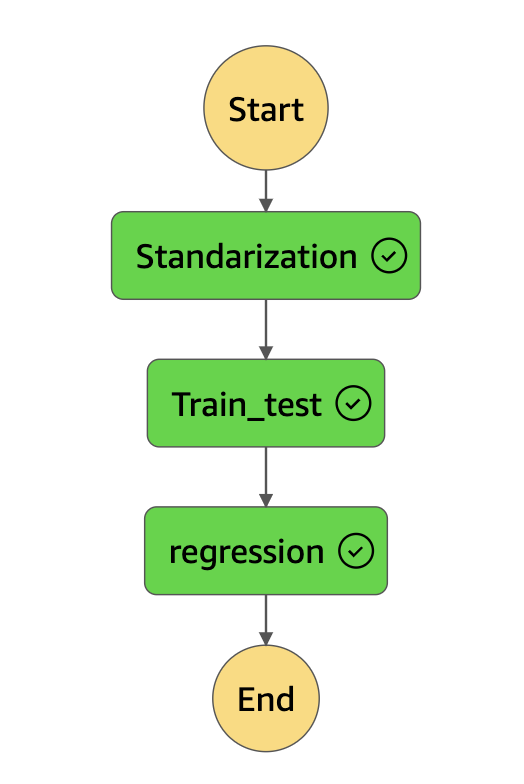

### Demo video
<div align="left">
 
[](https://youtu.be/un0X_LWAUGo)

</div>


# AWS Lambda Functions and AWS Lambda Step Functions

## Introduction
AWS Lambda is a serverless computing service provided by Amazon Web Services (AWS) that allows you to run code without provisioning or managing servers. Lambda functions are designed to be event-driven, executing code in response to events such as HTTP requests, file uploads, database changes, and more.

AWS Lambda Step Functions, on the other hand, are a serverless orchestration service that enables you to coordinate multiple AWS services into serverless workflows. Step Functions allow you to design and execute workflows that integrate Lambda functions, AWS services, and external resources.

## Cargo lamda

First we created the projects:

```bash
cargo lambda new <name of the project>
```
Then you create your functions, in this example, I normalize the data and split it in training and test.

## Normalizing Data Lambda Function
The `normalizing_data` Lambda function is designed to normalize input data by calculating the mean and standard deviation for each column of the input matrix `x` and then standardizing the values based on these statistics. The input to this function is a JSON payload containing the data to be normalized in the format:

```json
{
    "x": [[1.0, 2.0], [3.0, 4.0], [5.0, 6.0], [7.0, 8.0], [9.0, 10.0]],
    "y": [0, 1, 1, 0, 1]
}
```

The way to do it locally is:

```
cargo lambda watch
cargo lambda invoke normalizing_data --data-file payload.json
```

The output of the `normalizing_data` Lambda function is a standardized version of `x` along with the corresponding `y` values.

## Train Test Split Lambda Function
The `train_test` Lambda function is responsible for splitting input data into training and test sets. It shuffles the input data and then splits it based on a 70% training and 30% test split. The input to this function is also a JSON payload containing the data to be split:

```json
{
    "x": [[1.0, 2.0], [3.0, 4.0], [5.0, 6.0], [7.0, 8.0], [9.0, 10.0]],
    "y": [0, 1, 1, 0, 1]
}
```

The output of the `train_test` Lambda function is the training and test sets of `x` and `y`.

## Building and Deploying Lambda Functions
To build and deploy Lambda functions written in Rust using Cargo Lambda, follow these steps:

1. **Cargo Lambda Build**: Use Cargo Lambda to build your Rust code into a Lambda-compatible package. Run the following command in your project directory:

   ```bash
   cargo lambda build
   ```

   This command will compile your Rust code and generate a ZIP file containing the Lambda function and its dependencies.

2. **Cargo Lambda Deploy**: After building the Lambda package, deploy it to AWS Lambda using the Cargo Lambda deploy command. Ensure that you have AWS credentials configured on your machine. Run the following command:

   ```bash
   cargo lambda deploy
   ```

**Functions Deployed**


After successful deployment, you can invoke your Lambda functions using AWS Lambda's API or integrate them with other AWS services through AWS Step Functions.

3. **Step Functions**

You can orchestrate several functions with lambda step functions machine, using lambda invoke:


Finally you can pass the payload and test the pipeline:




